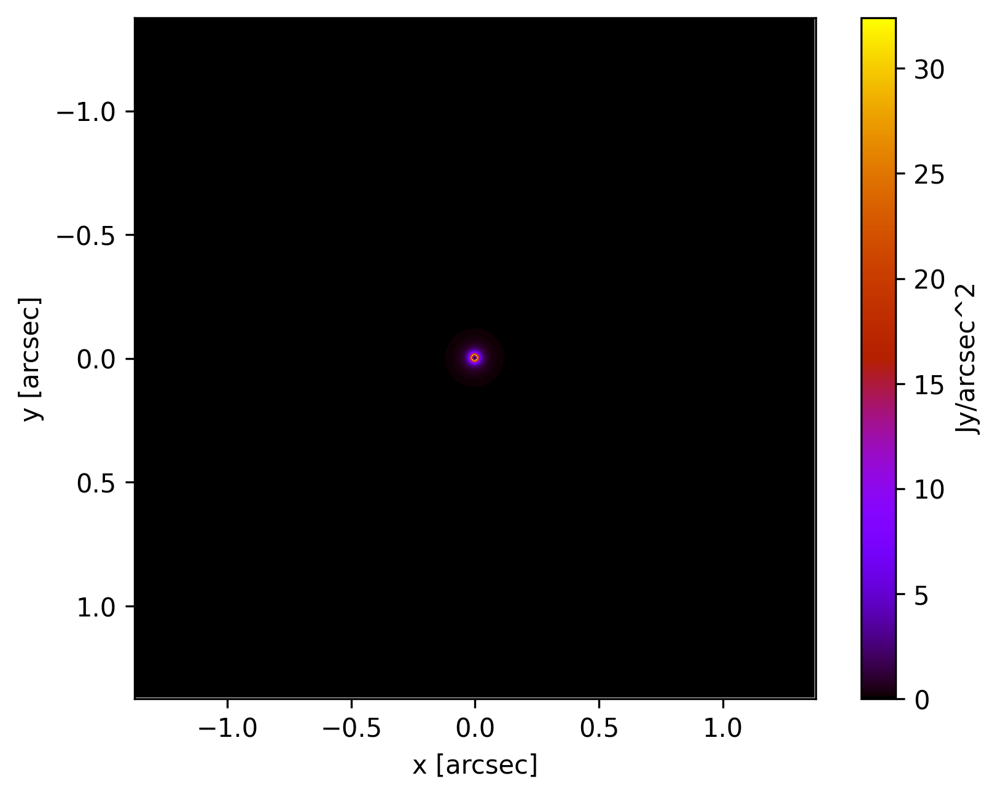
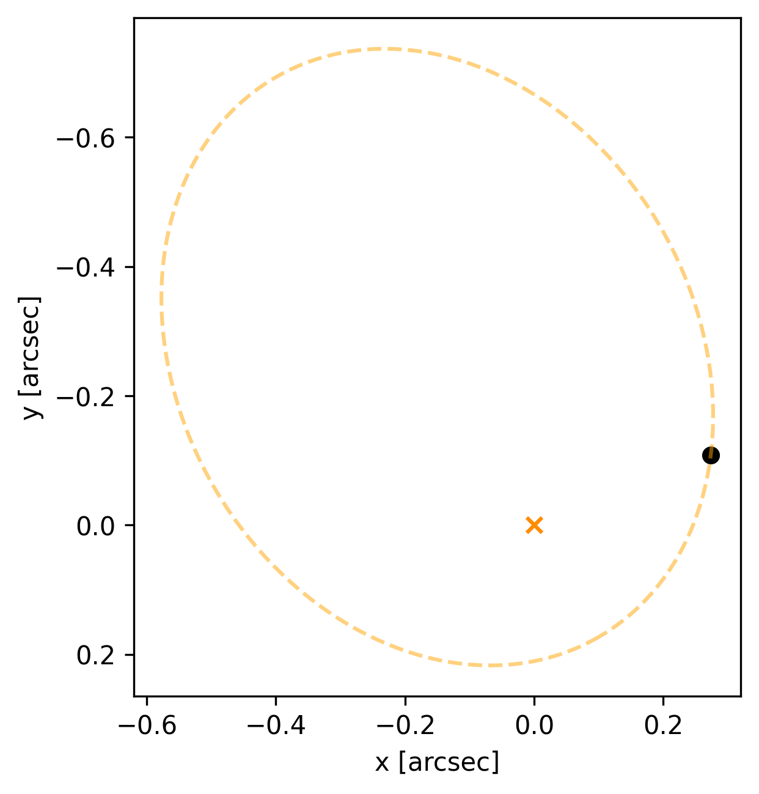

[](https://github.com/dreamjade/Toy_Coronagraph/blob/main/toycoronagraph/__init__.py)
<a href="https://pypi.org/project/toycoronagraph/"></a>
[](https://github.com/dreamjade/Toy_Coronagraph/tree/main/tests)
[](https://dreamjade.github.io/Toy_Coronagraph/index.html)
<a href="./LICENSE"></a>
[](https://zenodo.org/badge/latestdoi/665310914)
[](https://github.com/dreamjade/Toy_Coronagraph/tree/main/requirements.txt)

# Toy Coronagraph
<p align="center">

</p>

The toycoronagraph package is implemented in Python

Language | Release | Note
---------- | -------- | ------
Python | [On PyPI](https://pypi.python.org/pypi/toycoronagraph) | though not always the most recent [version](./toycoronagraph/__init__.py)

for simulating coronagraphs. It is designed to be simple and easy to use, while still providing a powerful and flexible framework for simulating a variety of coronagraph designs. 

The package includes a number of pre-defined coronagraph designs, as well as a library of functions for creating custom coronagraphs. It also includes a number of tools for visualizing the results of simulations, such as ray tracing plots and intensity maps.

The toycoronagraph package is open source and available on GitHub. It is a valuable tool for anyone interested in learning about coronagraphs or simulating the performance of coronagraph designs.

### Here are some of the features of this package:

* Simple and easy to use
* Powerful and flexible framework
* Pre-defined coronagraph designs
* Library of functions for creating custom coronagraphs
* Tools for visualizing the results of simulations
* Open source and available on GitHub

### Here are some of the applications of this package:

* Learning about coronagraphs
* Simulating the performance of coronagraph designs
* Designing new coronagraph designs
* Testing the performance of coronagraph hardware
* Studying the physics of light scattering

### Example

example target           |  Final image (Charge=2)  |  Final image (Charge=6)
:-------------------------:|:-------------------------:|:-------------------------:
 |  | 

#### with planets

Pre-image  |  Final image (Charge=6)
:-------------------------:|:-------------------------:
 | 

#### Turn on/off dust inside IWA

Final image (Charge=6)  |  Final image but ignored dust inside IWA (Charge=6)
:-------------------------:|:-------------------------:
 | 

#### Moving planet on an elliptic orbit

Frame definition
:-------------------------:


Plot the orbit (time = 0.2 period, starting from the perihelion and moving clockwise in the figure)
:-------------------------:


##### User could even make a video now

Video (Charge=6)  |  Video but ignored dust inside IWA (Charge=6)
:-------------------------:|:-------------------------:
 | 

### Example usage (Python)
This [py file](./tests/test.py) illustrates how the Python package is used.
```Python
import toycoronagraph.main as toy

# Load the example target image (example.fits) in Toy_Coronagraph/toycoronagraph/example_data/ folder
toy_target = toy.Target()

# Plot the preimage; the image will auto-save to origin.png
toy_target.plot_origin()

# Plot the final image through vortex coronagraph with charge = 2; the image will auto-save to charge2_final.png
toy_target.plot_final(charge=2)

# Plot the final image through vortex coronagraph with charge = 6; the image will auto-save to charge6_final.png
toy_target.plot_final(charge=6)

# Now add a static planet, where pos=(x_position, y_position)
toy_target.add_planet(pos=[0.5,0], brightness=0.00005, mode="cartesian")

# You could also add a moving planet on an elliptic orbit, where pos=(length of the semi-major axis, eccentricity, position angle, inclination angle, time/period))
toy_target.add_planet(pos=[0.5,0.6,60,0,0.1], brightness=0.00003, mode="moving")

# Plot the preimage with planets; the image will auto-save to origin_with_planets.png
toy_target.plot_origin()

# Plot the final image with planets; the image will auto-save to charge6_with_planets_final.png
toy_target.plot_final(charge=6)

# Plot the final image by turning off the target inside IWA; the image will auto-save to charge6_with_planets_iwa_ignore_final.png
toy_target.plot_final(charge=6, iwa_ignore=True)

# List the planets
toy_target.list_planets()
'''
Static Planet 1: (0.5, 0.0) arcsec, brightness: 5.00e-05 Jy
Moving Planet 2: (-0.3818058424930897, 0.08394161212137384) arcsec, brightness: 3.00e-05 Jy
'''

# Delete a specific planet
toy_target.delete_planet(order=1)
'''
Successfully remove planet #1, here is the latest planet list:
Moving Planet 1: (-0.3818058424930897, 0.08394161212137384) arcsec, brightness: 3.00e-05 Jy
'''

# Move a moving planet on its orbit by time/period=0.1
toy_target.planet_move(time=0.1, order=1)
'''
Planet has moved to new position
'''

# Plot the orbit of a specific moving planet; the image will auto-save to oribit_planet#.png
toy_target.plot_orbit(order=1)

# Plot the new preimage with planets; the image will auto-save to origin_with_planets.png
toy_target.plot_origin()

# Plot the new final image with planets; the image will auto-save to charge6_with_planets_final.png
toy_target.plot_final(charge=6)

# Print a specific planet brightness, background brightness, and background brightness (ignored dust inside IWA) in the final image through vortex coronagraph with charge = 6
toy_target.contrast(charge=6, order=1)
'''
This is a charge-6 vortex coronagraph.
'''

# Plot the core_throughput and inner working angle (in pixel)
import toycoronagraph.psf as psf
import numpy as np
psfs = np.load("psfs_c2.npy")
psf.cir_core_throughput_plot(psfs)

# Make the planet movie
toy_target.planet_video(charge=6)
# The video will be save to planet_video.mp4

# Make the planet movie again, but ignore the dust inside IWA
toy_target.planet_video(charge=6, iwa_ignore=True)
# The video will be save to planet_video_iwa_ignore.mp4
```
More instructions could be found in [docs](https://dreamjade.github.io/Toy_Coronagraph/index.html).
