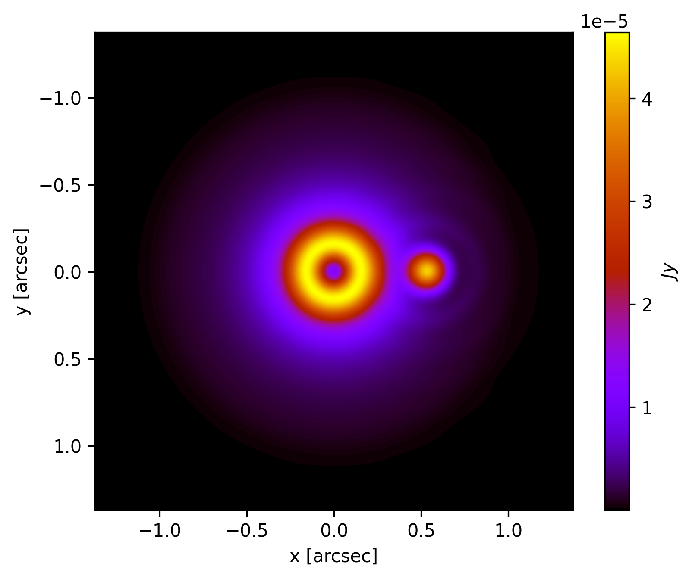

[](https://github.com/dreamjade/Toy_Coronagraph/blob/main/toycoronagraph/__init__.py)
<a href="https://pypi.org/project/toycoronagraph/"></a>
[](https://github.com/dreamjade/Toy_Coronagraph/tree/main/tests)
[](https://dreamjade.github.io/Toy_Coronagraph/)
<a href="./LICENSE"></a>
[](https://zenodo.org/badge/latestdoi/665310914)

# Toy Coronagraph

The toycoronagraph package is implemented in Python

Language | Release | Note
---------- | -------- | ------
Python | [On PyPI](https://pypi.python.org/pypi/toycoronagraph) | though not always the most recent [version](./toycoronagraph/__init__.py)

for simulating coronagraphs. It is designed to be simple and easy to use, while still providing a powerful and flexible framework for simulating a variety of coronagraph designs. 

The package includes a number of pre-defined coronagraph designs, as well as a library of functions for creating custom coronagraphs. It also includes a number of tools for visualizing the results of simulations, such as ray tracing plots and intensity maps.

The toycoronagraph package is open source and available on GitHub. It is a valuable tool for anyone interested in learning about coronagraphs or simulating the performance of coronagraph designs.

### Here are some of the features of this package:

* Simple and easy to use
* Powerful and flexible framework
* Pre-defined coronagraph designs
* Library of functions for creating custom coronagraphs
* Tools for visualizing the results of simulations
* Open source and available on GitHub

### Here are some of the applications of this package:

* Learning about coronagraphs
* Simulating the performance of coronagraph designs
* Designing new coronagraph designs
* Testing the performance of coronagraph hardware
* Studying the physics of light scattering

### Example

example target           |  Final image (Charge=2)  |  Final image (Charge=6)
:-------------------------:|:-------------------------:|:-------------------------:
 |  | 

#### with planet
Final image (Charge=2)  |  Final image (Charge=4)
:-------------------------:|:-------------------------:
 | 

#### planet moving
Frame definition
:-------------------------:


### Example usage (Python)
This [py file](./tests/test.py) illustrates how the Python package is used.
```Python
import toycoronagraph.main as toy

#load the example target image (example.fits) in Toy_Coronagraph/toycoronagraph/example_data/ folder
toy_target = toy.Target()

#plot the preimage, and the image will auto save in origin.png
toy_target.plot_origin()

#plot the final image through vortex coronagraph with charge = 2, and the image will auto save in charge2_final.png
charge = 2
toy_target.plot_final(charge)
```
More instructions could be found in [docs](https://dreamjade.github.io/Toy_Coronagraph/).
